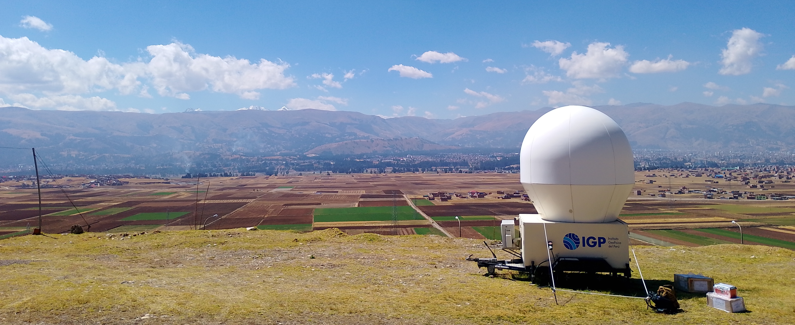

# Pulse Compression of Chirp Signals for Weather Radar SOPHy

  

  <em>SOPHy weather radar located at the Sicaya Observatory (Huancayo, Peru).</em>

## Overview
This repository contains waveform generation, data acquisition, and signal
processing algorithms developed during my undergraduate thesis at the
Radio Observatory of Jicamarca (ROJ). The work focuses on chirp-based
pulse compression techniques to improve signal-to-noise ratio in
meteorological radar systems.

The implemented framework integrates USRP-based transmission and reception
(adapted from MIT Haystack’s DigitalRF tools) with post-processing algorithms
based on the ROJ Signal Chain library, and is validated using real radar
data from the SOPHy weather radar.

## Scientific Context
Pulse compression is a key technique in modern solid-state weather radars,
allowing high sensitivity without sacrificing range resolution. Linear FM
(chirp) waveforms are particularly attractive due to their robustness and
processing gain when combined with matched filtering and Doppler processing.

## Methods
- Chirp waveform generation
- USRP-based transmission and reception
- Matched filtering and pulse compression
- Doppler spectrum analysis
- SNR estimation over azimuth angles
- Pulse Pair processing for radar moment estimation
- Validation using real data from the SOPHy weather radar
- Generation of PPI products including reflectivity, radial velocity,
  spectral width, and polarimetric variables

## Results
The results presented in this section correspond to a comparative evaluation
between the proposed chirp-based pulse compression scheme and the previously
used complementary code waveforms.

- Approximately 13.8 dB average SNR improvement
- Reduction of the blind range by approximately 150 m
- Extension of the detectable radial velocity range up to ±20 m/s
- Improved resolution with a PSLR of −30.7 dB, obtained from spectral analysis of the transmitted chirp waveform, providing an upper-bound estimate of pulse compression performance

## Repository Structure
- `tx/`: Waveform generation and transmission scripts using a USRP platform  
  (adapted from MIT Haystack DigitalRF; includes chirp waveform generation)
- `rx/`: USRP-based data acquisition scripts adapted from DigitalRF, storing
  received data in HDF5 format
- `processing/`: Signal processing scripts based on the ROJ Signal Chain library,
  including Doppler spectrum estimation and PPI generation using Pulse Pair
- `results/`: PPI plots, Doppler spectra, and animated radar products
- `schain/`: Signal processing library developed by the ROJ
- `legacy/`: Early exploratory scripts and development drafts
- `test/`: Scripts and auxiliary files used during thesis data acquisition

## Requirements
- Python 3.10+
- NumPy
- SciPy
- Matplotlib
- Digital RF software framework (`digital_rf`) – MIT Haystack Observatory
- Signal Chain processing library (`schain`) – ROJ

## Key Resources and Links

1. **MIT Haystack Observatory – Digital RF**  
   Flexible software framework for RF signal recording, storage, and playback,
   widely used in radar and radio science applications.  
   https://github.com/MITHaystack/digital_rf
2. **ROJ – Signal Chain Library (`schain`)**  
   Radar signal processing library used for Doppler spectrum estimation, PPI
   generation, and polarimetric variable computation.  
   https://intranet.igp.gob.pe/jicamarca/rhodecode/schain/commits?branch=v3.0-WR
3. **Real-Time Weather Radar Products**  
   Public real-time visualization of reflectivity and Doppler products from the
   SOPHy weather radar system.  
   https://www.igp.gob.pe/observatorios/radio-observatorio-jicamarca/realtime/plot/400/reflectivity/
4. **GNURADIO_CHIRP – Chirp waveform generation and experiments**  
   Scripts developed by David Evangelista during his internship at ROJ in 2024.
   https://github.com/sebastianVP/GNURADIO_CHIRP

## Author
**David Fernando Evangelista Cuti**  
B.Sc. Electronic Engineering – National University of Engineering (UNI), Peru

